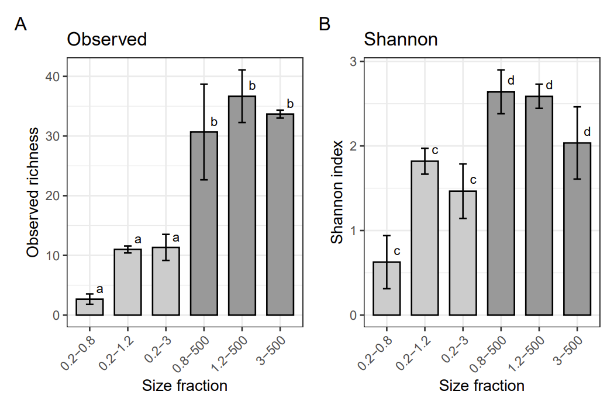
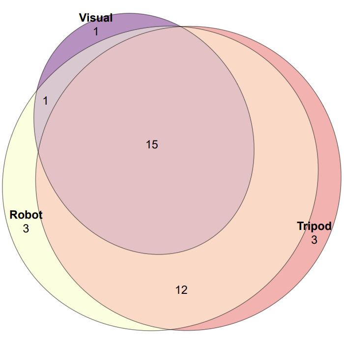
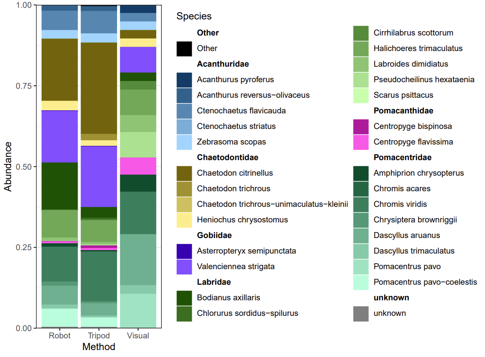
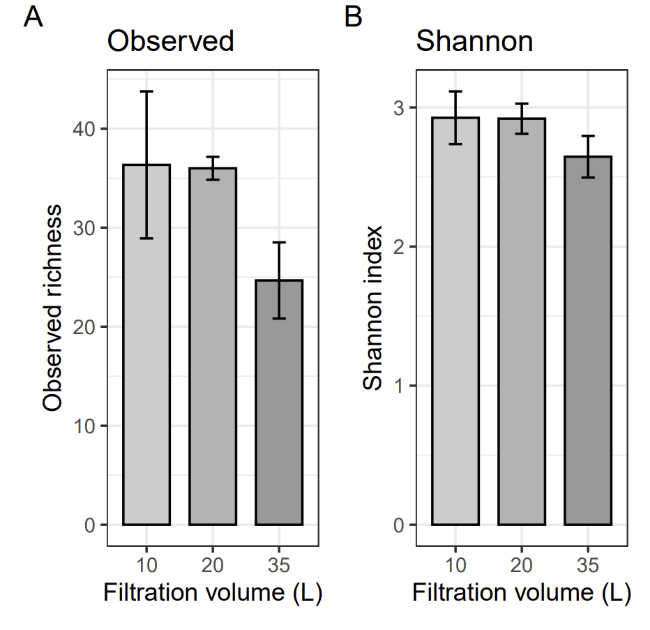
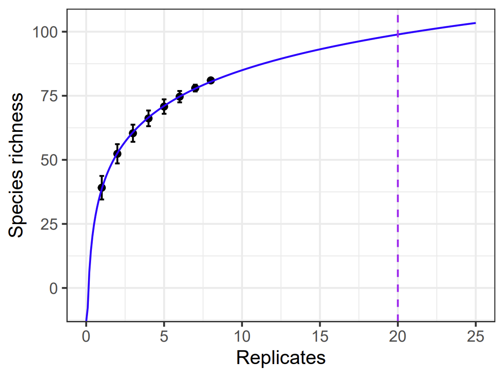
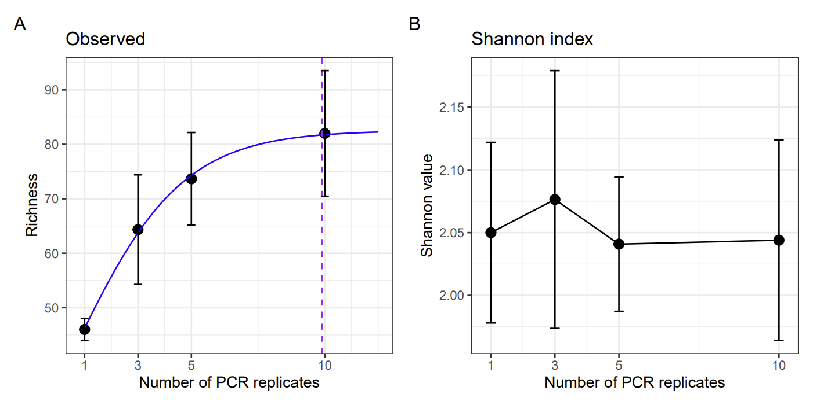
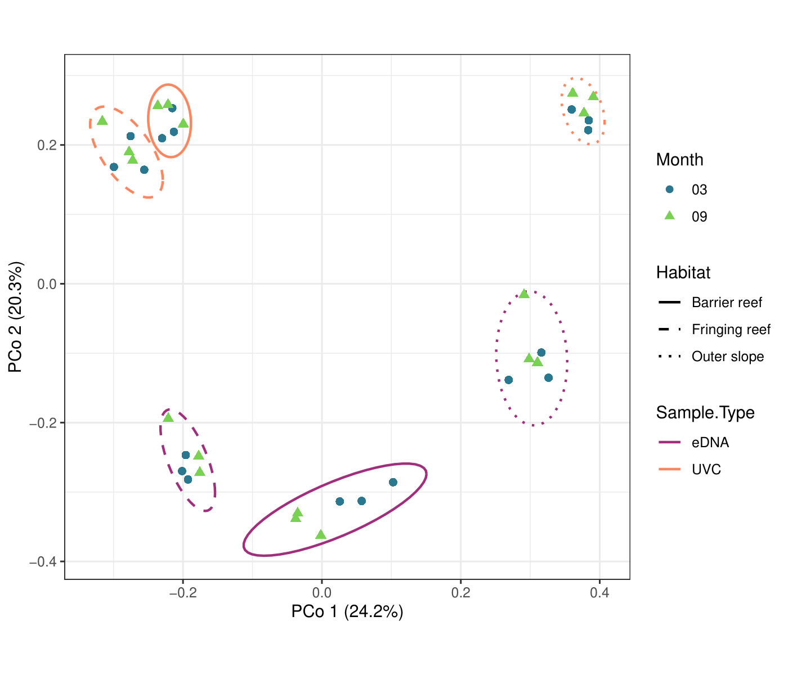
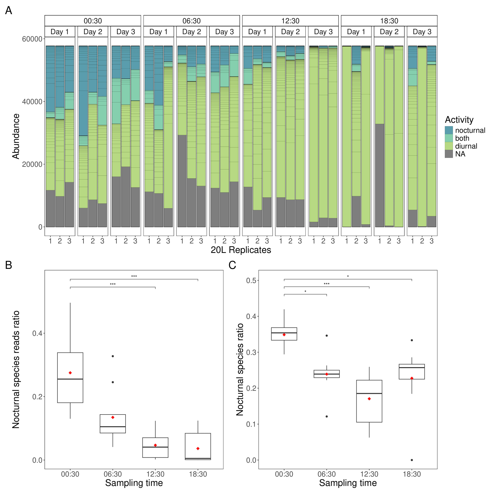

# Commons scripts to all figures
## Loading the working environment
```r
source("Functions.R")

library(ggplot2)
theme_set(theme_bw())
library(dplyr)
```
## Reading metadatas file 
```r
metadatas <- read.csv(file = "Datas.csv", header = T, sep = ";", dec = ",", na.strings = "NA", fileEncoding = "ISO-8859-1")
metadatas <- metadatas[which(!is.na(metadatas$Barcod)),]
metadatas$Barcod <- sprintf("%02d",metadatas$Barcod)
# match sample names with OTU table
metadatas$Run_Barcod <- paste0(metadatas$Run.name,"_barcode",metadatas$Barcod,"_concatenated")
```
## Reading OTU table file 
```r
Res <- read.table(file='Res_Decona/BLAST_out_reclustered_summary_tax_seq_counts.txt',sep ="\t", header = T, na.string = "")

# Remove Homo sapiens reads
Res <- Res[-which(Res$tax.id == "9606"),]

rownames(Res) <- Res$clusters.id
```
## Rarefaction
```r
Tab_raw <- Res[,15:dim(Res)[2]]

#total number of species at each site (row of data)
S <- vegan::specnumber(t(Tab_raw))

# Number of INDIVIDULS per site
raremax <- min(rowSums(t(Tab_raw), na.rm = T)) 

# rarefy, w/ raremax as input
Srare <- vegan::rarefy(t(Tab_raw), raremax)

Tab_rar <- vegan::rrarefy(t(Tab_raw), raremax)
Tab_rar <- as.data.frame(t(Tab_rar))
Tab_rar$clusters.id <- row.names(Tab_rar)
Res_rar <- dplyr::right_join(as.data.frame(Res)[,c(1:14)], Tab_rar, by = c("clusters.id" = "clusters.id"))
```
## Switch from a table dataframe to melt format and merge metadatas informations. 
```r
Res_melt <- Melting_x(Res, x = 15, metadatas_selected_col = c("Run_Barcod","Sample.ID","Replica"))
Res_melt_rar <- Melting_x(Res_rar, x = 15, metadatas_selected_col = c("Run_Barcod","Sample.ID","Replica"))
Res_melt_rar <- Res_melt_rar[-which(is.na(Res_melt_rar$Nb.reads)),]

# Checking unknowns ratio
100 * sum(subset(Res_melt,Res_melt$Family=="unknown")$Nb.reads)/sum(Res_melt$Nb.reads)
100 * sum(subset(Res_melt_rar,Res_melt_rar$Family=="unknown")$Nb.reads)/sum(Res_melt_rar$Nb.reads)

# Copying Figure 2 from  https://journals.plos.org/plosone/article?id=10.1371/journal.pone.0176343
Tab <- reshape2::acast(Res_melt, value.var = "Nb.reads", clusters.id~Sample.ID, fill = 0, fun.aggregate = sum)
Tab <- reshape2::acast(Res_melt_rar, value.var = "Nb.reads", clusters.id~Sample.ID, fill = 0, fun.aggregate = sum)
df <- Replica_OTU(Tab, col = c(1, 4, 7, 10, 17, 20, 23, 26, 29, 32, 35, 38))

df$sample <- rownames(df)
df_plot  <- reshape2::melt(df, id = "sample", variable.name = "replicas", value.name = "pc")
df_plot$sample <- substr(df_plot$sample, 1, nchar(df_plot$sample) - 2)

df_plot

ggplot(df_plot, aes(x = sample, y = pc, fill = replicas)) +
  geom_bar(stat = "identity") +
  theme(axis.text.x = element_text(angle = 90, hjust = 1)) +
  labs(x = "Sample", y = "% of OTUs Identified", fill = "Replicas") + 
  scale_fill_manual(values = c("3 replicates"= "grey95", "2 replicates" = "grey75", "1 replicate" = "grey50"))
```
## Group OTUs by Species taxa
```r
# Group by Taxonomic assignation (tax.id) and Sample
# mean all parameters weigthed by the number of reads
# keep the most representative sequence
Tax_melt <- Res_melt_rar %>%
  group_by(tax.id, Sample.ID, Replica, Family, Taxon) %>%
  summarise(
    Nb.reads_sum = sum(Nb.reads),
    X.ID_mean = weighted.mean(X.ID, Nb.reads),
    alignment.length_mean = weighted.mean(alignment.length, Nb.reads),
    mismatches_mean = weighted.mean(mismatches, Nb.reads),
    gap.opens_mean = weighted.mean(gap.opens, Nb.reads),
    evalue_mean = weighted.mean(evalue, Nb.reads),
    bit.score_mean = weighted.mean(bit.score, Nb.reads),
    qcovs_mean = weighted.mean(qcovs, Nb.reads),
    sequence_max = sequence[which.max(Nb.reads)][1]
  ) %>%
  group_by(Sample.ID) %>%
  mutate(
    relative_biomass = 100 * Nb.reads_sum / sum(Nb.reads_sum)
  ) %>%
  ungroup()

Tax_melt$Sample.Type <- "eDNA"

# geom_pont() plot to visualize distribution between bitscore and alignment.length
p <- ggplot(Tax_melt, aes(x=bit.score_mean, y=alignment.length_mean)) + geom_point()
# add marginal histogram
ggExtra::ggMarginal(p, type="density")

# Assigning to unknown assignation with bit.score inferior to 250
Tax_melt[which(Tax_melt$bit.score_mean < 250),"Taxon"] <- "unknown"
Tax_melt[which(Tax_melt$bit.score_mean < 250),"Family"] <- "unknown"
Tax_melt[which(Tax_melt$bit.score_mean < 250),"X.ID_mean"] <- NA

# Checking assignation with a aligment length superior to 175 and inferieur to 160 which are unexepected.
unique(Tax_melt[which(Tax_melt$alignment.length_mean > 175), "Taxon"])
unique(Tax_melt[which(Tax_melt$alignment.length_mean < 160), "Taxon"])

# Checking the unknown reads ratio
100 * sum(subset(Tax_melt,Tax_melt$Family=="unknown")$Nb.reads_sum)/sum(Tax_melt$Nb.reads_sum)

# Transforming from melt format to table format
Tax_table <- reshape2::acast(Tax_melt, value.var = "Nb.reads_sum", Taxon~Sample.ID, fill = 0, fun.aggregate = sum)
Tax_table <- reshape2::acast(Tax_melt, value.var = "relative_biomass", Taxon~Sample.ID, fill = 0, fun.aggregate = sum)
```
## Creating a phyloseq object
```r
# OTUs object
OTUs <- phyloseq::otu_table(as.data.frame(Tax_table), taxa_are_rows = T)

# TAX object
TAX <- data.frame(unique(Tax_melt[c("Family", "Taxon")]), row.names = unique(Tax_melt$Taxon))
names(TAX) <-  c("Family", "Species")
TAX <- phyloseq::tax_table(as.matrix(TAX))

# SAMPLE object
sample <- data.frame(metadatas, row.names = metadatas$Sample.ID)
SAMPLE <- phyloseq::sample_data(sample)

# Phyloseq object
physeq <- phyloseq::phyloseq(OTUs, TAX, SAMPLE)
```
# Figure 2 : Porosity - Alpha Diversity 
<p align="center">
  
</p>

```r
rich = phyloseq::estimate_richness(physeq_wout_Ctrl, measures = c("Observed", "Chao1", "Shannon", "InvSimpson"))
data <- merge(as.data.frame(phyloseq::sample_data(physeq)), rich, by.x = "row.names", by.y = "row.names")
data$Group <- ifelse(data$Size.fraction %in% c("0.2-0.8", "0.2-1.2", "0.2-3"),"a", "b")
data[,c("Size.fraction","Group","Observed","Shannon")]

df_labels <- data %>%
  filter(Sample.Type != "Control") %>%
  group_by(Size.fraction, Group) %>%
  summarise(Observed = mean(Observed), .groups = "drop")

# A : Observed
p1 <- ggplot(subset(data, Sample.Type != "Control"), aes(x = Size.fraction, y = Observed, fill = Group)) +
  stat_summary(fun = mean, geom = "bar", color = "black", width = 0.7) +
  stat_summary(fun.data = mean_se, geom = "errorbar", width = 0.2) +
  labs(y = "Observed richness", x = "Size fraction", title = "Observed") + 
  scale_fill_manual(values = c("a" = "gray80", "b" = "gray60")) +
  scale_x_discrete(guide = guide_axis(angle = 45)) + theme(legend.position = "none") + 
  geom_text(data = df_labels, aes(label = Group), nudge_x = 0.27, nudge_y = 1.8, size = 3)
p1

data$Group <- ifelse(data$Size.fraction %in% c("0.2-0.8", "0.2-1.2", "0.2-3"),"c", "d")

df_labels <- data %>%
  filter(Sample.Type != "Control") %>%
  group_by(Size.fraction, Group) %>%
  summarise(Shannon = mean(Shannon), .groups = "drop")

# B : Shannon
p2 <- ggplot(subset(data, Sample.Type != "Control"), aes(x = Size.fraction, y = Shannon, fill = Group)) +
  stat_summary(fun = mean, geom = "bar", color = "black", width = 0.7) +
  stat_summary(fun.data = mean_se, geom = "errorbar", width = 0.2) +
  labs(y = "Shannon index", x = "Size fraction", title = "Shannon") + 
  scale_fill_manual(values = c("c" = "gray80", "d" = "gray60")) +
  scale_x_discrete(guide = guide_axis(angle = 45)) + theme(legend.position = "none") + 
  geom_text(data = df_labels, aes(label = Group), nudge_x = 0.27, nudge_y = 0.14, size = 3)
p2

(p1 | p2) + plot_annotation(tag_levels = 'A')

ggsave(path = Images_path, filename = "Figure2.pdf", width = 6, height = 4)
```
# Figure 3: Euler plot - Robot vs Tripod
<p align="center">
  
</p>

```r
Tab_Euler <- Tax_melt
Tab_Euler <- aggregate(as.numeric(Tab_Euler$relative_abundance), by= list(Method = Tab_Euler$Method, Species = Tab_Euler$Taxon), mean)
Tab_Euler <- acast(Tab_Euler, value.var = "x", Tab_Euler$Species~Tab_Euler$Method, fill = 0)
Tab_Euler <- as.data.frame(Tab_Euler) %>% 
  select("Robot", "Tripode", "Visual Census")
colnames(Tab_Euler) <- c("Robot", "Tripod", "Visual Census")

Tab_Euler_final <- ifelse(Tab_Euler == 0,FALSE,TRUE)

pdf(file = paste0(Images_path,"Figure3.pdf"), width = 5, height = 5)
set.seed(19980821)
plot(eulerr::euler(Tab_Euler_final, shape = "ellipse"), fills = c("#4A90E2", "#F5A623", "#50E3C2"), quantities = TRUE, alpha = 0.5)
dev.off()
```
# Figure 4: Barplot - Robot vs Tripod
<p align="center">
  
</p>

```r
top_nested <- fantaxtic::nested_top_taxa(physeq, top_tax_level = "Family", nested_tax_level = "Species", n_top_taxa = 7, n_nested_taxa = 8, include_na_taxa = T)
# Little modifcation of the plot_nested_bar function from the fantaxtic library.
## Changing x = "Sample" to x = x_value (to be passed as an argument)
## Removing the angle of the x-axis
## Changing the light theme to bw
plot_nested_bar_Lucie <- function (ps_obj, top_level, nested_level, top_merged_label = "Other", x_value,
                                   nested_merged_label = "Other <tax>", palette = NULL, base_clr = "#008CF0", 
                                   merged_clr = "grey90", include_rank = T, na_taxon_label = "<tax> (<rank>)", 
                                   asv_as_id = F, duplicate_taxon_label = "<tax> <id>", relative_abundances = T, 
                                   sample_order = NULL, ...) 
{
  library(dplyr)
  ps_tmp <- ps_obj %>% fantaxtic::name_na_taxa(include_rank = include_rank, 
                                               na_label = na_taxon_label)
  ps_tmp <- ps_tmp %>% fantaxtic::label_duplicate_taxa(tax_level = nested_level, 
                                                       asv_as_id = asv_as_id, duplicate_label = duplicate_taxon_label)
  pal <- fantaxtic::taxon_colours(ps_tmp, tax_level = top_level, merged_label = top_merged_label, 
                                  merged_clr = merged_clr, palette = palette, base_clr = base_clr)
  psdf <- phyloseq::psmelt(ps_tmp)
  psdf <- fantaxtic::move_label(psdf = psdf, col_name = top_level, label = top_merged_label, 
                                pos = 0)
  psdf <- fantaxtic::move_nested_labels(psdf, top_level = top_level, 
                                        nested_level = nested_level, top_merged_label = top_merged_label, 
                                        nested_label = gsub("<tax>", "", nested_merged_label), 
                                        pos = Inf)
  if (!is.null(sample_order)) {
    if (all(sample_order %in% unique(psdf$Sample))) {
      psdf <- psdf %>% mutate(Sample = factor(Sample, 
                                              levels = sample_order))
    }
    else {
      stop("Error: not all(sample_order %in% sample_names(ps_obj)).")
    }
  }
  
  p <- ggnested::ggnested(psdf, aes_string(main_group = top_level, sub_group = nested_level, 
                                           x = x_value, y = "Abundance"), ..., main_palette = pal) + 
    scale_y_continuous(expand = c(0, 0)) + ggnested::theme_nested(theme_bw) + guides(fill=guide_legend(ncol=2)) #+ 
  #theme(axis.text.x = element_text(hjust = 1, vjust = 0.5, angle = 90))

  if (relative_abundances) {
    p <- p + geom_col(position = position_fill())
  }
  else {
    p <- p + geom_col()
  }
  return(p)
}

plot_nested_bar_Lucie_RvsT(ps_obj = top_nested$ps_obj, top_level = "Family", nested_level = "Species", x_value= "Method",
                      palette = c(unknown = "gray50"),
                      merged_clr = "black",
                      legend_title = "Species")
ggsave(path = Images_path, filename = "Figure4.pdf", width = 7.5, height = 5.5)
```
# Figure 5: Alpha Diversity - Volume
<p align="center">
  
</p>

```r
rich = phyloseq::estimate_richness(physeq_wout_Ctrl, measures = c("Observed", "Chao1", "Shannon", "InvSimpson"))
data <- merge(as.data.frame(phyloseq::sample_data(physeq_wout_Ctrl)), rich, by.x = "row.names", by.y = "row.names")
data[,c("Filtration.volume","Observed","Shannon")]
data <- cbind(data,Nb.reads = t(t(colSums(phyloseq::otu_table(physeq_wout_Ctrl)))))

# A : Observed
pA <- ggplot(data, aes(x = factor(Filtration.volume), y = Observed, fill = factor(Filtration.volume))) +
  stat_summary(fun = mean, geom = "bar", color = "black", width = 0.7) +
  stat_summary(fun.data = mean_se, geom = "errorbar", width = 0.2) +
  #geom_jitter(width = 0.1, size = 2, alpha = 0.6) +
  labs(y = "Observed richness", x = "Filtration volume (L)", title = "Observed") + 
  scale_fill_manual(values = c("gray80", "gray70", "gray60")) + theme(legend.position = "none")

# B : Shannon
pB <- ggplot(data, aes(x = factor(Filtration.volume), y = Shannon, fill = factor(Filtration.volume))) +
  stat_summary(fun = mean, geom = "bar", color = "black", width = 0.7) +
  stat_summary(fun.data = mean_se, geom = "errorbar", width = 0.2) +
  #geom_jitter(width = 0.1, size = 2, alpha = 0.6) +
  labs(y = "Shannon index", x = "Filtration volume (L)", title = "Shannon") + 
  scale_fill_manual(values = c("gray80", "gray70", "gray60"))+ theme(legend.position = "none")

(pA | pB ) + plot_annotation(tag_levels = 'A')
ggsave(path = Images_path, filename = "Figure5.pdf", width = 4, height = 4)
```
# Figure 6: Accumulation curves 
<p align="center">
  
</p>

## Sampling replicates
```r
sp <- vegan::specaccum(t(Tax_table), method = "collector")
plot(sp, ci.type="poly", col="blue", lwd=2, ci.lty=0, ci.col="lightblue", main = "Species Accumulation curve", xlab = "Replicas", ylab = "Number of species")

# Regression 
## Data from vegan::specaccum function.
df <- data.frame(
  Sites     = c(1, 2, 3, 4, 5, 6, 7, 8),
  Richness  = c(39.12500, 52.35714, 60.37500, 66.18571, 70.78571, 74.64286, 78.00000, 81.00000),
  SD        = c(4.59449, 3.75907, 3.34113, 3.05885, 2.81151, 2.21539, 1.32288, 0)
)

## Logarithmic model
log_model <- lm(Richness ~ log(Sites), data = df)

## Model parameters
intercept <- coef(log_model)["(Intercept)"]
slope     <- coef(log_model)["log(Sites)"]

## Candidate sites to test
sites_test <- 1:1000

## Expected increment for adding one more site
delta <- slope * log((sites_test + 1) / sites_test)

## First site where increment < 1
sites_plateau <- sites_test[delta < 1][1]

## Extended prediction curve
sites_new <- seq(0, max(sites_plateau, max(df$Sites)) + 5, by = 0.1)
df_pred <- data.frame(Sites = sites_new)
df_pred$Predicted <- predict(log_model, newdata = df_pred)

plot_Sampling-rep <- ggplot(df, aes(x = Sites, y = Richness)) +
  geom_point() +
  geom_errorbar(aes(ymin = Richness - SD, ymax = Richness + SD), width = 0.3) +
  geom_line(data = df_pred, aes(y = Predicted), color = "blue") +
  geom_vline(xintercept = sites_plateau, linetype = "dashed", color = "purple") +
  labs(x = "Replicates") + 
  ylab("Species richness")
```
## PCR replicates
```r
# Summarize OTU richness by PCR replicates
summary_richness <- Nb %>%
  group_by(Rep) %>%
  summarise(
    mean_richness = mean(Nb_OTUs),
    sd_richness   = sd(Nb_OTUs)
  )

# Logistic regression model
logistic_model <- nls(mean_richness ~ a / (1 + exp(-(Rep - b)/c)),
                      data = summary_richness,
                      start = list(a = max(summary_richness$mean_richness),
                                   b = median(summary_richness$Rep), c = 1))

# Plateau (99%)
a <- coef(logistic_model)["a"]
b <- coef(logistic_model)["b"]
c <- coef(logistic_model)["c"]
plateau <- a
p <- 0.99
target_value <- p * plateau
replicates_99 <- b - c * log(a / target_value - 1)

# Extended predictions for logistic curve
replicates_new <- seq(1, max(ceiling(replicates_99), max(summary_richness$Rep)) + 2, by = 0.1)
df_pred <- data.frame(Rep = replicates_new)
df_pred$Pred_logistic <- predict(logistic_model, newdata = df_pred)

p_richness <- ggplot(summary_richness, aes(x = Rep, y = mean_richness)) +
  geom_point(size = 3) +
  geom_errorbar(aes(ymin = mean_richness - sd_richness,
                    ymax = mean_richness + sd_richness), width = 0.2) +
  geom_line(data = df_pred, aes(y = Pred_logistic), color = "blue", size = 1) +
  geom_vline(xintercept = replicates_99, linetype = "dashed", color = "purple") +
  scale_x_continuous(breaks = c(1, 3, 5, 10)) +
  labs(
    x = "Number of PCR replicates",
    y = "Richness",
    title = "Observed richness"
  )

# Shannon index 
shannon_df <- Tax_melt %>%
  group_by(Sample.ID) %>%
  mutate(p = Nb.reads_sum / sum(Nb.reads_sum)) %>%
  summarise(Shannon = -sum(p * log(p))) %>%
  tidyr::separate(Sample.ID, into = c("Origin", "Rep"), sep = "_") %>%
  mutate(
    Origin = as.factor(Origin),
    Rep = as.numeric(Rep)
  )

p_shannon <- ggplot(shannon_df, aes(x = Rep, y = Shannon, color = factor(Origin))) +
  geom_point(size = 3) +
  geom_line() +
  scale_x_continuous(breaks = c(1, 3, 5, 10)) +
  labs(
    x = "Number of PCR replicates",
    y = "Shannon index",
    color = "Sample",
    title = "Effect of PCR replicates on Shannon index"
  ) +
  theme_minimal() +
  theme(
    text = element_text(size = 14),
    plot.title = element_text(face = "bold", hjust = 0.5)
  )

(p_richness | p_shannon) + plot_annotation(tag_levels = 'A')
ggsave(path = Images_path, filename = "Figure6.pdf", width = 8, height = 4)
```
## Sequencing depth
```r
plot(S, Srare, xlab = "Observed No. of Species", 
     ylab = "Rarefied No. of Species",
     main = "plot(rarefy(Tab, raremax))", 
     xlim = c(0,max(S,Srare)), 
     ylim = c(0,max(S,Srare)))
abline(0, 1)

vegan::rarecurve(t(Tab_raw), step = 20, sample = raremax, col = "blue", cex = 0.6, label = F,
                 main = "rarefaction curve on subset of data",
                 ylab = "Species richness")

# x-axis in log scale 
rc <- vegan::rarecurve(t(Tab_raw), step = 20, 
                 col = "blue", cex = 0.6, 
                 label = T,
                 abline(v = raremax), 
                 plot = FALSE)

plot_Rar <- plot(attr(rc[[1]], "Subsample"), rc[[1]],
     type = "n",
     log = "x",
     xlab = "Sample size (log)",
     ylab = "Species richness",
     main = "Rarefaction curve")
for (i in seq_along(rc)) {
  lines(attr(rc[[i]], "Subsample"), rc[[i]], col = "blue")
}

(plot_Sample_rep | plot_PCR_rep) / plot_Rar + plot_annotation 
ggsave(path = Images_path, filename = "Figure6.pdf", width = 4, height = 3)

```
# Figure 9: Distance matrix - Tiahura 
<p align="center">
  
</p>

```r
#Turn the Tax table with Visual Census data to a 0/1 matrix
Tax_table_wVC_01 <- ifelse(Tax_table_wVC != 0 , 1, 0)

# Assess jaccard and bray curtis distance for eDNA data
dist.jc.eDNA <- betapart::beta.pair(t(Tax_table_01[,1:18]), index.family="jaccard")
dist.bc.eDNA <- vegan::vegdist(t(Tax_table_wVC[,1:18]), method = "bray")

# for Visual Census data
dist.jc.VC <- betapart::beta.pair(t(Tax_table_wVC_01[,19:36]), index.family="jaccard")
dist.bc.VC <- vegan::vegdist(t(Tax_table_wVC[,19:36]), method = "bray")

# for both data
dist.jc.both <- betapart::beta.pair(t(Tax_table_wVC_01), index.family="jaccard")
dist.bc.both <- vegan::vegdist(t(Tax_table_wVC), method = "bray")

# Function based on pheatmap library 
my_pheatmap <- function(dist, main_text, legend_bool)
{
  mat <- as.matrix(dist)
  
  # Extract habitat and month
  habitat <- stringr::str_extract(colnames(mat), "^\\w+\\s+\\w+")
  month <- stringr::str_extract(colnames(mat), "\\d{2}(?= \\d$)")
  month_text <- ifelse(month == "03", "March", "September")
  rep <- sub(".* (\\d)$", "\\1", colnames(mat))
  
  # New labels displayed
  display_labels <- paste("replica", rep)
  
  # Define splits to group rows/columns
  annotation_col <- data.frame(
    Month   = month_text,
    Habitat = habitat
  )
  rownames(annotation_col) <- colnames(mat)
  
  annotation_row <- annotation_col
  
  habitat_levels <- levels(factor(annotation_row$Habitat))
  month_levels <- levels(factor(annotation_row$Month))
  
  annotation_colors <- list(
    Habitat = setNames(viridisLite::magma(length(habitat_levels), begin = 0.3, end = 0.9), habitat_levels),
    Month   = setNames(viridisLite::viridis(length(month_levels), begin = 0.3, end = 0.8), month_levels)
  )
  
  # pheatmap without color for annotations, only to group
  plot_pheatmap <- pheatmap::pheatmap(mat,
                                      cluster_rows = FALSE,
                                      cluster_cols = FALSE,
                                      labels_row = display_labels,
                                      labels_col = display_labels,
                                      annotation_row = annotation_row,
                                      annotation_col = annotation_col,
                                      annotation_colors = annotation_colors,
                                      show_rownames = TRUE,
                                      show_colnames = TRUE,
                                      border_color = "white", 
                                      main = main_text, 
                                      legend = legend_bool, 
                                      annotation_legend = legend_bool, 
                                      cellwidth = 15,
                                      cellheight = 15
  )
  return(plot_pheatmap) 
}

eDNA_Jac <- my_pheatmap(dist = dist.jc.eDNA$beta.jac, main_text = "eDNA", legend_bool = T)
VC_Jac <- my_pheatmap(dist = dist.jc.VC$beta.jac, main_text = "Visual Census", legend_bool = F)

library(grid)
library(gridExtra)

# Extract gtables
g1 <- eDNA_Jac$gtable
g2 <- VC_Jac$gtable

# Export final figure
pdf(paste0(Images_path,"Figure9.pdf"), width = 15, height = 6) 
grid.arrange(g1, g2, ncol = 2)
dev.off()


ggsave(path = Images_path, filename = "Figure7.pdf", width = 4, height = 3)

```
# Figure 8: PCoA - Tiahura
<p align="center">
  
</p>

```r
#Performing PCOA
pcoa <- cmdscale(dist.jc.both$beta.jac, eig = T, add = T)
position <- pcoa$points[,c(1,2)]
colnames(position) <- c("Dim1","Dim2")

# Naming axis
percent_explained <- round(100 * pcoa$eig / sum(pcoa$eig), digits = 1)
percent_explained[1:2]
labs <- c(glue::glue("PCo 1 ({percent_explained[1]}%)"), glue::glue("PCo 2 ({percent_explained[2]}%)"))

#Merging sample_data
pcoa_data <- merge(as.data.frame(position), as.data.frame(Tax_melt_wVC), by.x = 0, by.y = "Sample.ID")

pcoa_data <- pcoa_data %>%
  mutate(Month_comb = factor(Month)) 

plot_pcoa <- ggplot(pcoa_data, aes(x = Dim1, y = Dim2)) +
  stat_ellipse(aes(color = Sample.Type, linetype = Habitat),
               type = "norm", level = 0.97, size = 0.75) +
  scale_color_viridis_d(option = "magma", begin = 0.45, end = 0.75) +
  ggnewscale::new_scale_color() +
  geom_point(aes(color = Month, shape = Month), size = 2) +
  scale_color_viridis_d(option = "viridis", begin = 0.4, end = 0.8, name = "Month") +
  scale_shape_manual(values = c(16, 17), name = "Month") +
  scale_linetype_manual(values = c(1,2,3)) +
  guides(
    color = guide_legend(
      override.aes = list(shape = c(16, 17))
    ),
    shape = "none"
  ) +
  labs(x = labs[1], y = labs[2]) +
  coord_equal()

plot_pcoa

ggsave(path = Images_path, file = "Figure10.pdf", plot = my_plot, height = 6, width = 7 )
```
# Figure 9: Fish Activity ratio

<p align="center">
  
</p>

```r
paletteA <- c(
  nocturnal = "#5a9dad",
  both      = "#84cfb0",
  diurnal   = "#b7d980"
)

plot_Activity <- phyloseq::plot_bar(physeq, fill = "Activity", x = "Replica") +
  scale_color_manual(na.value = "grey50") + 
  scale_fill_manual(values= paletteA )

plot_Activity$data[,"Activity"] <- factor(plot_Activity$data[,"Activity"], levels = c("nocturnal", "both", "diurnal"))

plot_Activity <-  plot_Activity + xlab("20L Replicates") +
  scale_x_discrete(guide = guide_axis(angle = 0)) + geom_col(color = "black", size = 0.05) + 
  ggh4x::facet_nested(~ Sampling.Time + paste("Day",Sampling.Day), scales = "free", space = "free_x") + 
  theme(panel.grid = element_blank(), 
        strip.background = element_rect(fill = "white", colour = "black"), 
        text=element_text(size = 20))  + 
  geom_col(color = "black", size = 0)
plot_Activity

data <- Tax_melt_wA[,c("Sample.ID","Replica","Family","Taxon","Sampling.Time","Sampling.Day","Nb.reads_sum","Activity")]

# Shapiro-Wilk normality distribtion test
shapiro.test(data$Nb.reads_sum)

# Number of reads ratio
ratio_quant <- data %>%
  group_by(Sample.ID, Sampling.Time) %>%
  summarise(
    reads_nocturnal = sum(ifelse(Activity == "nocturnal", Nb.reads_sum, 0), na.rm = TRUE),
    reads_nocturnal_both = sum(ifelse(Activity == "nocturnal" | Activity == "both" , Nb.reads_sum, 0), na.rm = TRUE),
    reads_total = sum(Nb.reads_sum, na.rm = TRUE),
    ratio_nocturnal = reads_nocturnal / reads_total, 
    ratio_nocturnal_both = reads_nocturnal_both / reads_total
  )

# Presence/absence ratio
ratio_qual <- data %>%
  group_by(Sample.ID, Sampling.Time) %>%
  summarise(
    species_nocturnal = n_distinct(Taxon[Activity == "nocturnal"]),
    species_total = n_distinct(Taxon),
    ratio_nocturnal = species_nocturnal / species_total
  )

sum(subset(data, Sample.ID == "1.00.1" & Activity == "nocturnal")$Nb.reads_sum)
sum(subset(data, Sample.ID == "1.00.1")$Nb.reads_sum)

shapiro.test(ratio_quant$ratio_nocturnal)
shapiro.test(ratio_qual$ratio_nocturnal)

kruskal.test(ratio_nocturnal ~ Sampling.Time, data = ratio_quant)
kruskal.test(ratio_nocturnal ~ Sampling.Time, data = ratio_qual)

# Post-hoc Dunn test
dunn_quant <- FSA::dunnTest(ratio_nocturnal ~ Sampling.Time, data = ratio_quant, method = "bonferroni")
dunn_qual <- FSA::dunnTest(ratio_nocturnal ~ Sampling.Time, data = ratio_qual, method = "bonferroni")

# Function to extract Dunn test results for ggpubr
prepare_dunn_df <- function(dunn_result, data, y_col) {
  dunn_result$res %>%
    rename(comparison = Comparison,
           p.adj = P.adj) %>%
    mutate(
      # Split comparison into two groups
      group1 = sub(" - .*", "", comparison),
      group2 = sub(".*- ", "", comparison),
      # Define significance levels
      p.adj.signif = case_when(
        p.adj <= 0.001 ~ "***",
        p.adj <= 0.01  ~ "**",
        p.adj <= 0.05  ~ "*",
        TRUE           ~ "ns"
      )
    ) %>%
    # Keep only significant comparisons
    filter(p.adj.signif != "ns") %>%
    # Define y-position for annotations
    mutate(y.position = max(data[[y_col]]) * (1.05 + row_number() * 0.05))
}

dunn_quant_df <- prepare_dunn_df(dunn_quant, ratio_quant, "ratio_nocturnal")
dunn_qual_df  <- prepare_dunn_df(dunn_qual,  ratio_qual,  "ratio_nocturnal")

plot_ratio_quant <- ggplot(ratio_quant, aes(x = Sampling.Time, y = ratio_nocturnal)) +
  geom_boxplot(width = 0.6) +
  stat_summary(fun = mean, geom = "point", shape = 18, size = 3, color = "red") +
  labs(y = "Nocturnal species reads ratio",x = "Sampling time") +
  theme(legend.position = "none", 
        panel.grid = element_blank(), 
        text=element_text(size = 20))

plot_ratio_quant <- plot_ratio_quant + ggpubr::stat_pvalue_manual(
  data = dunn_quant_df,
  label = "p.adj.signif",
  tip.length = 0.01
)

plot_ratio_quant

plot_ratio_qual <- ggplot(ratio_qual, aes(x = Sampling.Time, y = ratio_nocturnal)) +
  geom_boxplot(width = 0.6) +
  stat_summary(fun = mean, geom = "point", shape = 18, size = 3, color = "red") +
  labs(y = "Nocturnal species ratio",x = "Sampling time") +
  theme(legend.position = "none", 
        panel.grid = element_blank(), 
        text=element_text(size = 20))

plot_ratio_qual <- plot_ratio_qual + ggpubr::stat_pvalue_manual(
  data = dunn_qual_df,
  label = "p.adj.signif",
  tip.length = 0.01
)

plot_ratio_qual

plot_Activity / (plot_ratio_quant | plot_ratio_qual) + plot_annotation(tag_levels = 'A')
ggsave(path = Images_path_final, "Figure9.pdf", width = 15, height = 15)
```