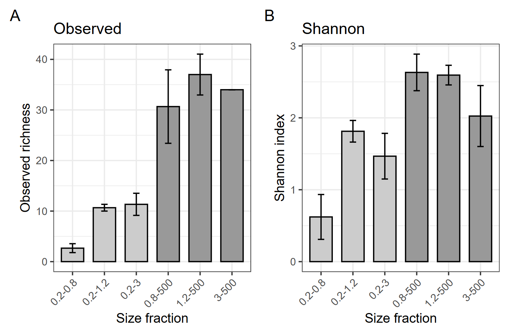
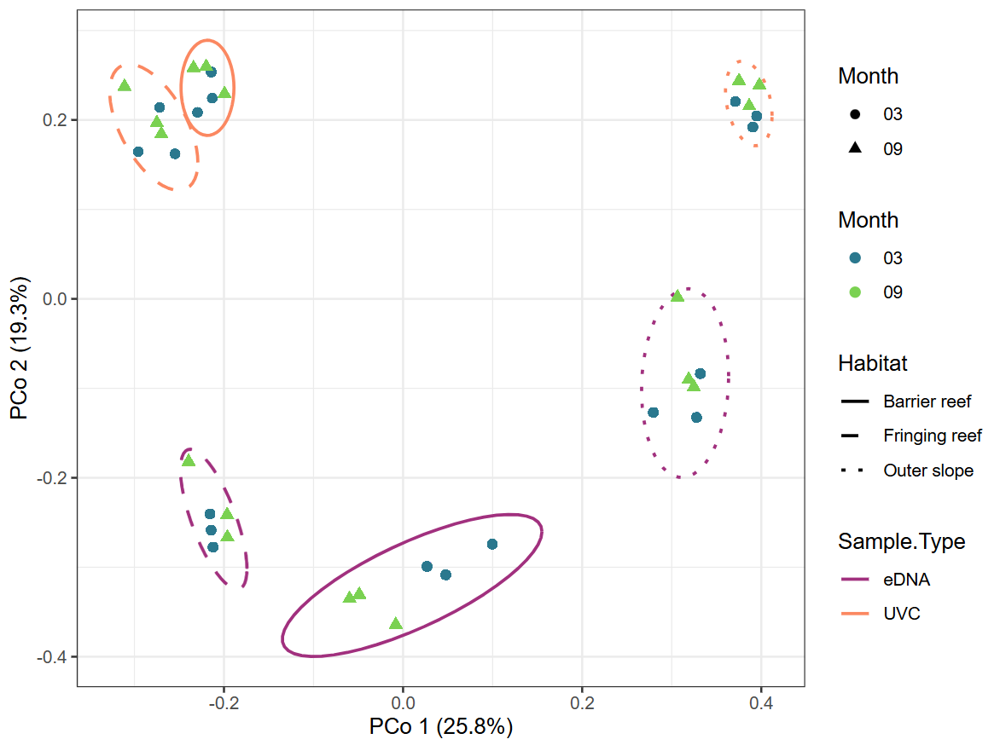
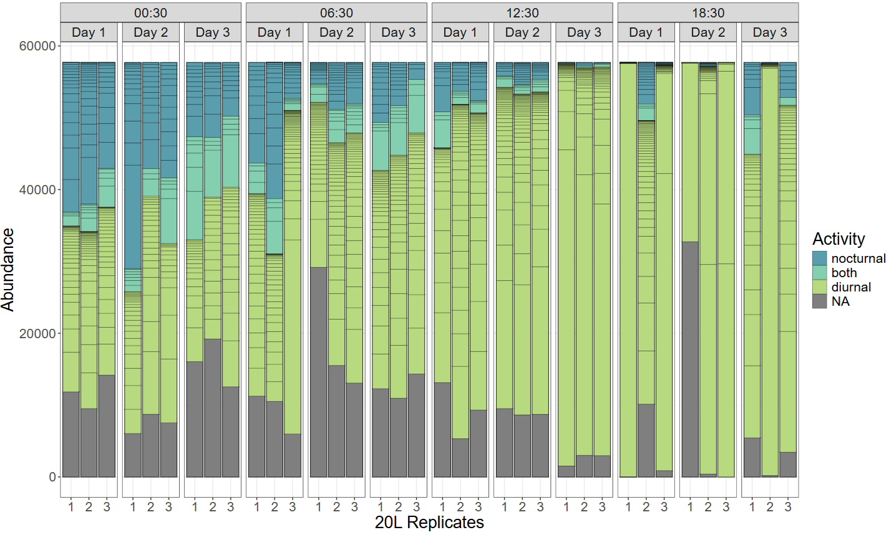

# Commons scripts to all figures
## Loading the working environment
```r
source("Functions.R")

library(ggplot2)
theme_set(theme_bw())
library(dplyr)
```
## Reading metadatas file 
```r
metadatas <- read.csv(file = "Datas.csv", header = T, sep = ";", dec = ",", na.strings = "NA", fileEncoding = "ISO-8859-1")
metadatas <- metadatas[which(!is.na(metadatas$Barcod)),]
metadatas$Barcod <- sprintf("%02d",metadatas$Barcod)
# match sample names with OTU table
metadatas$Run_Barcod <- paste0(metadatas$Run.name,"_barcode",metadatas$Barcod,"_concatenated")
```
## Reading OTU table file 
```r
Res <- read.table(file='Res_Decona/BLAST_out_reclustered_summary_tax_seq_counts.txt',sep ="\t", header = T, na.string = "")

# Remove Homo sapiens reads
Res <- Res[-which(Res$tax.id == "9606"),]

rownames(Res) <- Res$clusters.id
```
## Rarefaction
```r
Tab_raw <- Res[,15:dim(Res)[2]]
#Tab_raw[is.na(Tab_raw)] <- 0 

#total number of species at each site (row of data)
S <- vegan::specnumber(t(Tab_raw))

# Number of INDIVIDULS per site
raremax <- min(rowSums(t(Tab_raw), na.rm = T)) 

# rarefy, w/ raremax as input
Srare <- vegan::rarefy(t(Tab_raw), raremax)
Tab_raw
Srare

#Plot rarefaction results
pdf(paste0(Images_path,"rarefaction.pdf"), width = 9, height = 6)
#par(mfrow = c(1,2))
plot(S, Srare, xlab = "Observed No. of Species", 
     ylab = "Rarefied No. of Species",
     main = "plot(rarefy(Tab, raremax))", 
     xlim = c(0,max(S,Srare)), 
     ylim = c(0,max(S,Srare)))
abline(0, 1)
vegan::rarecurve(t(Tab_raw), step = 20, sample = raremax, col = "blue", cex = 0.6, label = F,
                 main = "rarecurve() on subset of data")
dev.off()

c(S-Srare)[order(S-Srare, decreasing = T)]

Tab_rar <- vegan::rrarefy(t(Tab_raw), raremax)

Tab_rar <- as.data.frame(t(Tab_rar))
Tab_rar$clusters.id <- row.names(Tab_rar)
Res_rar <- dplyr::right_join(as.data.frame(Res)[,c(1:14)], Tab_rar, by = c("clusters.id" = "clusters.id"))
```
## Switch from a table dataframe to melt format and merge metadatas informations. 
```r
Res_melt <- Melting_x(Res, x = 15, metadatas_selected_col = c("Run_Barcod","Sample.ID","Replica"))
Res_melt_rar <- Melting_x(Res_rar, x = 15, metadatas_selected_col = c("Run_Barcod","Sample.ID","Replica"))
Res_melt_rar <- Res_melt_rar[-which(is.na(Res_melt_rar$Nb.reads)),]

# Checking unknowns ratio
100 * sum(subset(Res_melt,Res_melt$Family=="unknown")$Nb.reads)/sum(Res_melt$Nb.reads)
100 * sum(subset(Res_melt_rar,Res_melt_rar$Family=="unknown")$Nb.reads)/sum(Res_melt_rar$Nb.reads)

# Copying Figure 2 from  https://journals.plos.org/plosone/article?id=10.1371/journal.pone.0176343

Tab <- reshape2::acast(Res_melt, value.var = "Nb.reads", clusters.id~Sample.ID, fill = 0, fun.aggregate = sum)
Tab <- reshape2::acast(Res_melt_rar, value.var = "Nb.reads", clusters.id~Sample.ID, fill = 0, fun.aggregate = sum)
df <- Replica_OTU(Tab, col = c(1, 4, 7, 10, 17, 20, 23, 26, 29, 32, 35, 38))

df$sample <- rownames(df)
df_plot  <- reshape2::melt(df, id = "sample", variable.name = "replicas", value.name = "pc")
df_plot$sample <- substr(df_plot$sample, 1, nchar(df_plot$sample) - 2)

df_plot

ggplot(df_plot, aes(x = sample, y = pc, fill = replicas)) +
  geom_bar(stat = "identity") +
  theme(axis.text.x = element_text(angle = 90, hjust = 1)) +
  labs(x = "Sample", y = "% of OTUs Identified", fill = "Replicas") + 
  scale_fill_manual(values = c("3 replicates"= "grey95", "2 replicates" = "grey75", "1 replicate" = "grey50"))
```
## Group OTUs by Species taxa
```r
# Group by Taxonomic assignation (tax.id) and Sample
# mean all parameters weigthed by the number of reads
# keep the most representative sequence
Tax_melt <- Res_melt_rar %>%
  group_by(tax.id, Sample.ID, Replica, Family, Taxon) %>%
  summarise(
    Nb.reads_sum = sum(Nb.reads),
    X.ID_mean = weighted.mean(X.ID, Nb.reads),
    alignment.length_mean = weighted.mean(alignment.length, Nb.reads),
    mismatches_mean = weighted.mean(mismatches, Nb.reads),
    gap.opens_mean = weighted.mean(gap.opens, Nb.reads),
    evalue_mean = weighted.mean(evalue, Nb.reads),
    bit.score_mean = weighted.mean(bit.score, Nb.reads),
    qcovs_mean = weighted.mean(qcovs, Nb.reads),
    sequence_max = sequence[which.max(Nb.reads)][1]
  ) %>%
  group_by(Sample.ID) %>%
  mutate(
    relative_biomass = 100 * Nb.reads_sum / sum(Nb.reads_sum)
  ) %>%
  ungroup()

Tax_melt$Sample.Type <- "eDNA"

# geom_pont() plot to visualize distribution between bitscore and alignment.length
p <- ggplot(Tax_melt, aes(x=bit.score_mean, y=alignment.length_mean)) + geom_point()
# add marginal histogram
ggExtra::ggMarginal(p, type="density")

# Assigning to unknown assignation with bit.score inferior to 250
Tax_melt[which(Tax_melt$bit.score_mean < 250),"Taxon"] <- "unknown unknown"
Tax_melt[which(Tax_melt$bit.score_mean < 250),"Family"] <- "unknown"
Tax_melt[which(Tax_melt$bit.score_mean < 250),"X.ID_mean"] <- NA

# Checking assignation with a aligment length superior to 175 and inferieur to 160 which are unexepected.
unique(Tax_melt[which(Tax_melt$alignment.length_mean > 175), "Taxon"])
unique(Tax_melt[which(Tax_melt$alignment.length_mean < 160), "Taxon"])

# Checking the unknown reads ratio
100 * sum(subset(Tax_melt,Tax_melt$Family=="unknown")$Nb.reads_sum)/sum(Tax_melt$Nb.reads_sum)

# Transforming from melt format to table format
Tax_table <- reshape2::acast(Tax_melt, value.var = "Nb.reads_sum", Taxon~Sample.ID, fill = 0, fun.aggregate = sum)
Tax_table <- reshape2::acast(Tax_melt, value.var = "relative_biomass", Taxon~Sample.ID, fill = 0, fun.aggregate = sum)
```
## Creating a phyloseq object
```r
# OTUs object
OTUs <- phyloseq::otu_table(as.data.frame(Tax_table), taxa_are_rows = T)

# TAX object
TAX <- data.frame(unique(Tax_melt[c("Family", "Taxon")]), row.names = unique(Tax_melt$Taxon))
names(TAX) <-  c("Family", "Species")
TAX <- phyloseq::tax_table(as.matrix(TAX))

# SAMPLE object
sample <- data.frame(metadatas, row.names = metadatas$Sample.ID)
SAMPLE <- phyloseq::sample_data(sample)

physeq <- phyloseq::phyloseq(OTUs, TAX, SAMPLE)

physeq <- phyloseq::subset_samples(physeq, Sample.Type != "Control")

```
# Figure 2 : Porosity - Alpha Diversity 
<p align="center">
  
</p>

```r
rich <- phyloseq::estimate_richness(physeq, measures = c("Observed", "Chao1", "Shannon", "InvSimpson"))
data <- merge(as.data.frame(phyloseq::sample_data(physeq)), rich, by.x = "row.names", by.y = "row.names")
data$Group <- ifelse(data$Size.fraction %in% c("0.2-0.8", "0.2-1.2", "0.2-3"), "Group1", "Group2")
data[,c("Size.fraction","Group","Observed","Shannon")]

# Plot A : Observed
pA <- ggplot(subset(data, Sample.Type != "Control"), aes(x = Size.fraction, y = Observed, fill = Group)) +
  stat_summary(fun = mean, geom = "bar", color = "black", width = 0.7) +
  stat_summary(fun.data = mean_se, geom = "errorbar", width = 0.2) +
  labs(y = "Observed richness", x = "Size fraction", title = "Observed") + 
  scale_fill_manual(values = c("Group1" = "gray80", "Group2" = "gray60")) +
  scale_x_discrete(guide = guide_axis(angle = 45)) + theme(legend.position = "none")

# Plot B : Shannon
pB <- ggplot(subset(data, Sample.Type != "Control"), aes(x = Size.fraction, y = Shannon, fill = Group)) +
  stat_summary(fun = mean, geom = "bar", color = "black", width = 0.7) +
  stat_summary(fun.data = mean_se, geom = "errorbar", width = 0.2) +
  labs(y = "Shannon index", x = "Size fraction", title = "Shannon") + 
  scale_fill_manual(values = c("Group1" = "gray80", "Group2" = "gray60")) +
  scale_x_discrete(guide = guide_axis(angle = 45)) + theme(legend.position = "none")

(pA | pB) + plot_annotation(tag_levels = 'A')
```
# Figure 3: Euler plot - Robot vs Tripod
<p align="center">
  
</p>

```r
Tab_Euler <- Tax_melt
Tab_Euler <- aggregate(as.numeric(Tab_Euler$relative_abundance), by= list(Method = Tab_Euler$Method, Species = Tab_Euler$Taxon), mean)
Tab_Euler <- acast(Tab_Euler, value.var = "x", Tab_Euler$Species~Tab_Euler$Method, fill = 0)
Tab_Euler <- as.data.frame(Tab_Euler) %>% 
  select("Robot", "Tripode", "Visual Census")
colnames(Tab_Euler) <- c("Robot", "Tripod", "Visual Census")

Tab_Euler_final <- ifelse(Tab_Euler == 0,FALSE,TRUE)

pdf(file = paste0(Images_path,"Euler_plot.pdf"), width = 5, height = 5)
set.seed(19980821)
plot(eulerr::euler(Tab_Euler_final, shape = "ellipse"), fills = c("#4A90E2", "#F5A623", "#50E3C2"), quantities = TRUE, alpha = 0.5)
dev.off()
```
# Figure 4: Barplot - Robot vs Tripod
<p align="center">
  
</p>

```r
top_nested <- fantaxtic::nested_top_taxa(physeq, top_tax_level = "Family", nested_tax_level = "Species", n_top_taxa = 7, n_nested_taxa = 8, include_na_taxa = T)
# Little modifcation of the plot_nested_bar function from the fantaxtic library.
plot_nested_bar_Lucie(ps_obj = top_nested$ps_obj, top_level = "Family", nested_level = "Species", x_value= "Rep",
                      palette = c(unknown = "gray50"), merged_clr = "black", legend_title = "Species") +
  facet_grid(~Method, scales = "free_x", space = "free_x") + 
  xlab("20L Replica")
```
# Figure 5: Alpha Diversity - Volume
<p align="center">
  
</p>

```r
rich = phyloseq::estimate_richness(physeq_wout_Ctrl, measures = c("Observed", "Chao1", "Shannon", "InvSimpson"))
data <- merge(as.data.frame(phyloseq::sample_data(physeq_wout_Ctrl)), rich, by.x = "row.names", by.y = "row.names")
data[,c("Filtration.volume","Observed","Shannon")]
data <- cbind(data,Nb.reads = t(t(colSums(phyloseq::otu_table(physeq_wout_Ctrl)))))

# Plot A : Observed
pA <- ggplot(data, aes(x = factor(Filtration.volume), y = Observed, fill = factor(Filtration.volume))) +
  stat_summary(fun = mean, geom = "bar", color = "black", width = 0.7) +
  stat_summary(fun.data = mean_se, geom = "errorbar", width = 0.2) +
  #geom_jitter(width = 0.1, size = 2, alpha = 0.6) +
  labs(y = "Observed richness", x = "Filtration volume (L)", title = "Observed") + 
  scale_fill_manual(values = c("gray80", "gray70", "gray60")) + theme(legend.position = "none")

# Plot B : Shannon
pB <- ggplot(data, aes(x = factor(Filtration.volume), y = Shannon, fill = factor(Filtration.volume))) +
  stat_summary(fun = mean, geom = "bar", color = "black", width = 0.7) +
  stat_summary(fun.data = mean_se, geom = "errorbar", width = 0.2) +
  #geom_jitter(width = 0.1, size = 2, alpha = 0.6) +
  labs(y = "Shannon index", x = "Filtration volume (L)", title = "Shannon") + 
  scale_fill_manual(values = c("gray80", "gray70", "gray60"))+ theme(legend.position = "none")

(pA | pB ) + plot_annotation(tag_levels = 'A')
```
# Figure 6: Accumulation curves - Sampling Replicates
<p align="center">
  
</p>

```r
sp <- vegan::specaccum(t(Tax_table), method = "collector")

pdf(paste0(Images_path,"spaceaccum.pdf"),width = 5, height = 5)
plot(sp, ci.type="poly", col="blue", lwd=2, ci.lty=0, ci.col="lightblue", 
    main = "Species Accumulation curve", xlab = "Replicas", ylab = "Number of species")
dev.off()
```
# Figure 7: PCR Replicates
<p align="center">
  
</p>

```r
Nb <- data.frame(Nb_OTUs = colSums(Tax_table != 0 ), 
                 Origin = stringr::str_split(colnames(Tax_table), "_", simplify= T)[,1],
                 Rep = as.numeric(stringr::str_split(colnames(Tax_table), "_", simplify= T)[,2]))

summary_data <- Nb %>%
  group_by(Rep) %>%
  summarise(
    mean_OTUs = mean(Nb_OTUs),
    sd_OTUs = sd(Nb_OTUs)
  )

p1 <- ggplot(summary_data, aes(x = Rep, y = mean_OTUs)) +
  geom_point(size = 3) +
  geom_line() +
  geom_errorbar(aes(ymin = mean_OTUs - sd_OTUs, ymax = mean_OTUs + sd_OTUs), width = 0.3) +
  scale_x_continuous(breaks = c(1, 3, 5, 10)) +
  labs(
    x = "Number of PCR replicates",
    y = "Mean number of OTUs (± SD)",
    title = "Observed"
  )

shannon_df <- Tax_melt %>%
  group_by(Sample.ID) %>%
  mutate(p = Nb.reads_sum / sum(Nb.reads_sum)) %>%
  summarise(Shannon = -sum(p * log(p))) %>%
  tidyr::separate(Sample.ID, into = c("Origin", "Rep"), sep = "_") %>%
  mutate(
    Origin = as.factor(Origin),
    Rep = as.numeric(Rep)
  )

summary_data <- shannon_df %>%
  group_by(Rep) %>%
  summarise(
    mean_OTUs = mean(Shannon),
    sd_OTUs = sd(Shannon)
  )

p2 <- ggplot(summary_data, aes(x = Rep, y = mean_OTUs)) +
  geom_point(size = 3) +
  geom_line() +
  geom_errorbar(aes(ymin = mean_OTUs - sd_OTUs, ymax = mean_OTUs + sd_OTUs), width = 0.3) +
  scale_x_continuous(breaks = c(1, 3, 5, 10)) +
  labs(
    x = "Number of PCR replicates",
    y = "Mean Shannon index (± SD)",
    title = "Shannon index"
  )

(p1 | p2) + plot_annotation(tag_levels = 'A')
```
# Figure 8: Sequencing depth
<p align="center">
  
</p>

```r
pdf(paste0(Images_path,"rarefaction.pdf"), width = 9, height = 6)
#par(mfrow = c(1,2))
plot(S, Srare, xlab = "Observed No. of Species", 
     ylab = "Rarefied No. of Species",
     main = "plot(rarefy(Tab, raremax))", 
     xlim = c(0,max(S,Srare)), 
     ylim = c(0,max(S,Srare)))
abline(0, 1)
vegan::rarecurve(t(Tab_raw), step = 20, sample = raremax, col = "blue", cex = 0.6, label = F, 
                 ylab = "Number of OTUs",
                 xlab = "Sample Size")
dev.off()
```
# Figure 9: Distance matrix - Tiahura 
<p align="center">
  
</p>

```r
dist.jc. <- betapart::beta.pair(t(ifelse(Tax_table != 0, 1, 0)), index.family="jaccard")
dist.bc. <- vegan::vegdist(t(Tax_table), method = "bray")

pheatmap::pheatmap(as.matrix(dist.jc$beta.jac), cluster_rows = F, cluster_cols = F, cellwidth = 10, cellheight = 10, legend = TRUE, main = "Jaccard")
pheatmap::pheatmap(as.matrix(dist.bc), cluster_rows = F, cluster_cols = F, cellwidth = 10, cellheight = 10, legend = TRUE, main = "BrayCurtis")
```
# Figure 10: PCoA - Tiahura
<p align="center">
  
</p>

```r
#Performing PCOA
pcoa <- cmdscale(dist.jc.both$beta.jac, eig = T, add = T)
position <- pcoa$points[,c(1,2)]
colnames(position) <- c("Dim1","Dim2")

# Naming axis
percent_explained <- round(100 * pcoa$eig / sum(pcoa$eig), digits = 1)
percent_explained[1:2]
labs <- c(glue::glue("PCo 1 ({percent_explained[1]}%)"), glue::glue("PCo 2 ({percent_explained[2]}%)"))

#Merging sample_data
pcoa_data <- merge(as.data.frame(position), as.data.frame(Tax_melt_wVC), by.x = 0, by.y = "Sample.ID")

pcoa_data %>% ggplot(aes_string(x = "Dim1", y = "Dim2", shape = "Sample.Type")) + 
  geom_point(aes_string(color = "Habitat"),size = 3)  + 
  labs(x = labs[1], y = labs[2]) +
  facet_wrap(~paste("Month",Month)) + 
  stat_ellipse(aes_string(fill = "Sample.Type"),geom = "polygon", type = "norm", level = 0.9, alpha = 0.2) + 
  scale_color_brewer(palette = "Paired")
```
# Figure 11: Barplot Activity - Along24h
<p align="center">
  
</p>

```r
palette["nocturnal"] <-"#5a9dad"
palette["both"] <- "#84cfb0"
palette["diurnal"] <- "#b7d980"

p <- phyloseq::plot_bar(physeq, fill = "Activity", x = "Replica") +
  scale_color_manual(na.value = "grey50") + 
  scale_fill_manual(values= palette )
p$data[,"Activity"] <- factor(p$data[,"Activity"], levels = c("nocturnal", "both", "diurnal"))
p + xlab("20L Replicates") +
  theme(text=element_text(size = 20)) + scale_x_discrete(guide = guide_axis(angle = 0)) + geom_col(color = "black", size = 0.05) + 
  ggh4x::facet_nested(~ Sampling.Time + paste("Day",Sampling.Day), scales = "free", space = "free_x")
```
# Figure 12: Nocturnal activity ratio

<p align="center">
  
</p>

```r
data <- Tax_melt[,c("Sample.ID","Replica","Family","Taxon","Sampling.Time","Sampling.Day","Nb.reads_sum","Activity")]

ratio <- data %>%
  group_by(Sample.ID, Sampling.Time) %>%
  summarise(
    reads_nocturnal = sum(ifelse(Activity == "nocturnal", Nb.reads_sum, 0), na.rm = TRUE),
    reads_nocturnal_both = sum(ifelse(Activity == "nocturnal" | Activity == "both" , Nb.reads_sum, 0), na.rm = TRUE),
    reads_total = sum(Nb.reads_sum, na.rm = TRUE),
    ratio_nocturnal = reads_nocturnal / reads_total, 
    ratio_nocturnal_both = reads_nocturnal_both / reads_total
  )

shapiro.test(ratio$ratio_nocturnal)
kruskal.test(ratio_nocturnal ~ Sampling.Time, data = ratio)
FSA::dunnTest(ratio_nocturnal ~ Sampling.Time, data = ratio, method = "bonferroni")

p <- ggplot(ratio, aes(x = Sampling.Time, y = ratio_nocturnal)) +
  geom_boxplot(width = 0.6) +
  stat_summary(fun = mean, geom = "point", shape = 18, color = "red") +
  labs(y = "Nocturnal species reads ratio", x = "Sampling time") +
  theme(legend.position = "none")

stat <- data.frame( group1 = c("00:30", "00:30"), group2 = c("12:30", "18:30"), y.position = c(0.6, 0.65),  p.adj = c(0.00065, 0.00019), p.adj.signif = c("***", "***"))
p + ggpubr::stat_pvalue_manual(data = stat, label = "p.adj.signif", tip.length = 0.01)
```