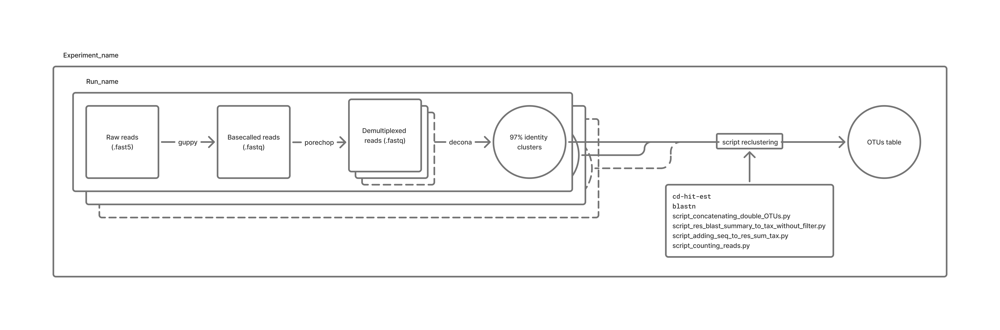

The following command lines is used to generate a unique **OTU table** from `.fast5` files of eDNA metabarcoding data from **Nanopore sequencing technology**.



The Bioinformatic pipeline folder contains: 
- `decona`: decona script from https://github.com/Saskia-Oosterbroek/decona
- `barcode_list.txt`: file example
- `header.txt` 
- `script_concatenating_double_OTUs.py` : Concatenating the reference database id of each OTU that share the same biscore
- `script_res_blast_summary_to_tax_without_filter.py`: Retrieving taxonomic lineage (Familly Genus, species) from one ore more tax IDs
- `script_adding_seq_to_res_sum_tax.py`: Adding corresponding consensus sequence to each OTU
- `script_counting_reads.py`: Counting the number of reads in each OTU cluster and create a matrix OTU table
The 12S reference database is describe and available at 10.5281/zenodo.16969829

The OTU table Analyses folder contains R scripts to built figure from *Optimizing a novel eDNA-based framework for Reef Fish Biodiversity monitoring using an Autonomous Filtration Systems and in situ Nanopore Sequencing*. **doi link**

# Bioinformatics pipeline
## Basecalling with guppy 
https://github.com/asadprodhan/GPU-accelerated-guppy-basecalling
``` bash 
# To find guppy config files : 
guppy_basecaller --print_workflows

# Example for a R9.4 Flowcell :
guppy_basecaller --input_path /path/to/$Experiment_name/$Run_name/$Run_id/fast5_pass/ --save_path $Experiement_name/$Run_name/basecalled/ -c /opt/ont/guppy/data/dna_r9.4.1_450bps_sup.cfg -x "cuda:0" --compress_fastq

# Example for a R10.4 Flowcell :
guppy_basecaller --input_path  /path/to/$Experiment_name/$Run_name/$Run_id/fast5/ --save_path $Experiement_name/$Run_name/basecalled/ -c /opt/ont/guppy/data/dna_r10.3_450bps_sup.cfg -x "cuda:0" --compress_fastq
```

## Demultiplexing with Porechop 
```bash 
porechop -i //fastq_source --require_two_barcodes -b //fastq_results --threads 16 --verbosity 2 > output 2>&1
# -b : demultiplex the reads into bins based on which barcode was found
# --require_two_barcodes : By default, Porechop only requires a single barcode match to bin a read. If you use the --require_two_barcodes option, then it will be much more stringent and assess the start and end of the read independently. I.e. to be binned, the start of a read must have a good match for a barcode and the end of the read must also have a good match for the same barcode.
# The --verbosity option will change the amount of progress info:
#   --verbosity 0 gives no progress output.
#   --verbosity 1 (default) gives summary info about end adapter trimming and middle adapter splitting.
#   --verbosity 2 shows the actual trimmed/split sequences for each read (described more below).
#   --verbosity 3 shows tons of data (mainly for debugging).
```
###### Reads Length distribution
```bash 
cd ~/fasTmp/$Experiment_name/$Run_name/Res_Porechop/
wc -l *.fastq | head -n -1 | awk '{printf "%.0f\n", $1/4}' | Rscript -e 'lines <- (readLines ("stdin"));data <- data.frame(NbReads = as.numeric(lines));dotchart(data$NbReads,xlab="Number of reads", labels = c("BC01","BC02","BC03","BC04","BC05","BC06","BC07","BC08","BC09", "BC10", "BC11","BC12", "BC13","BC15","BC23","BC24","none"), main="Number of reads in each barcode file")' ; mv Rplots.pdf DotChart_NbReadsPerBC.pdf

for BC in *.fastq ; do
  sed -n '1~4s/^@/>/p;2~4p' $BC > ${BC:0:-6}.fasta
  samtools faidx ${BC:0:-6}.fasta
  cut -f2 "${BC:0:-6}".fasta.fai | Rscript -e 'data <- as.numeric (readLines ("stdin")); summary(data); data <- data[data<1000]; hist(data, breaks = 500, xlab = "Reads length", main =  "Distribution of reads length")'
  mv Rplots.pdf ReadsLength_Distribution_"${BC:0:-6}".pdf
done
```
``` bash
for BC in *.fasta ; do
  cut -f2 $BC.fai | awk -v OFS='\t' -v file=${BC:0:-6} '{print $0, file}' >> Size_Distrib.txt
done
```
R script 
```r
library(ggplot2)
library(ggridges)

data <- read.table("Size_Distrib.txt")
names(data) <- c("Size","BC")

ggplot(data, aes(x = Size, y = BC)) + 
  geom_density_ridges(scale = 1.5) + 
  labs(title = "Size Distribution of each sample", subtitle = "<Run_name>") + 
  xlab("Size (pb)") + ylab("Sample")
ggsave(filename = paste0(path,"SizeDistrib.svg"), width = 10, height = 10)
```
## Decona 
Run the following command lines for each `$Run_name`:
```bash 
conda activate decona1.4
export PATH=$PATH:/path/to/minimap2

mkdir -p /path/to/$Experiment_name/$Run_name/Res_Decona/

cd /path/to/$Experiment_name/$Run_name/Res_Porechop/
for BC in BC*.fastq ; 
do 
  mkdir /path/to/$Experiment_name/$Run_name/Res_Decona/barcode${BC:2:-6}/ 
  ln -s /path/to/$Experiment_name/$Run_name/Res_Porechop/$BC /path/to/$Experiment_name/$Run_name/Res_Decona/barcode${BC:2:-6}/
done 
cd /home/eDNA/fasTmp/$Experiment_name/$Run_name/Res_Decona/

decona -l 180 -m 250 -q 10 -c 0.97 -n 10 -k 5 -i /path/to/$Experiment_name/$Run_name/Res_Decona/ -T 32 -fNCAM > /path/to/$Experiment_name/$Run_name/Res_Decona/output_97_n10 2>&1 
```
Now, you could call `script_reclustering.sh /path/to/DB250403_MiFish_Actino_v2_modified.fasta /path/to/$Experiment_name/barcode_list.txt /path/to/$Experiment_name/header.txt` or execute these several command lines.
## Reclustering script
``` bash
# Navigate to the root directory of all runs
rm -rf Res_Decona_all_runs
mkdir Res_Decona_all_runs/
for run in * ; do 
  if [ -e "$run/Res_Decona" ] ; then
    (
    cd $run/Res_Decona/
      # Concatenate the clusters from Medaka into an all_medaka_fasta file for each barcode, and add the attribute barcodeXX to each header
      (
      cd data/
        mkdir -p ../result/Medaka
        for folder in * ; do
          if [ -e "$folder/multi-seq" ] ; then
            (
            cd "$folder/multi-seq" || exit
              for con in consensus_medaka_*.fasta ; do
                if [ -e "$con" ] ; then
                  #echo "$con"
                  cat "$con" | awk '{print $1}' > n-"$con"
                  sed -i '1 s/.*/&_'"$con"'/' n-"$con"
                  sed -i 's/>.*consensus_medaka_/>consensus_medaka-/' n-"$con"
                else
                  continue
                fi
              done
              if [ "$(ls -1 n-con*.fasta 2>/dev/null | wc -l)" -gt 0 ] ; then
                rm all_medaka_fastas.fasta
                # concatenating clusters
                cat n-con*.fasta >> all_medaka_fastas.fasta
              fi
              # Add the attribute
              awk -v barcode="$folder" '{ if ($0 ~ /^>/) print ">" barcode "-" substr($0, 2); else print $0 }' all_medaka_fastas.fasta > "all_medaka_fastas_${folder}.fasta"
              # Move the fasta files into a result folder
              cp "all_medaka_fastas_${folder}.fasta" ../../../result/Medaka/"all_medaka_fastas_${folder}.fasta" 
            ) # Exit multi-seq, go to data
          fi
        done
      ) # Exit data, go to $run/Res_Decona/

      # Concatenate the barcodes and add the run attribute
      (
      cd result/Medaka/
        rm All_medaka_fastas*.fasta
        cat all_medaka_fastas_*.fasta >> All_medaka_fastas_all_barcodes.fasta
        awk -v run="$run" '{ if ($0 ~ /^>/) print ">" run "_" substr($0, 2) ; else print $0 }' All_medaka_fastas_all_barcodes.fasta > "All_medaka_fastas_all_barcodes_$run.fasta"
      ) # Exit result/Medaka/, go to $run/Res_Decona
    )
  fi
  cp $run/Res_Decona/result/Medaka/All_medaka_fastas_all_barcodes_$run.fasta Res_Decona_all_runs/ 
done 

cd Res_Decona_all_runs/
#rm All_medaka_fastas_all_barcodes_all_runs.fasta
cat All_medaka_fastas_all_barcodes_*.fasta >> All_medaka_fastas_all_barcodes_all_runs.fasta

# Reclustering all barcodes together
cd-hit-est -i All_medaka_fastas_all_barcodes_all_runs.fasta -o 2nd_clust.fasta -c 0.97 -n 5 -d 0 -aS 0.9 -G 0 -M 0 -T 32 -g 1 > output_reclustering 2>&1 
```
### Taxonomic assignation 
```bash
makeblastdb -in $1 -dbtype nucl -parse_seqids
blastn -query 2nd_clust.fasta -db $1 -perc_identity 80 -outfmt "6 qseqid pident length mismatch gapopen evalue bitscore qcovs salltitles sallseqid" -max_target_seqs 20 -max_hsps 500 -num_threads 32 > BLAST_out_reclustered.txt ;
# blastn options #

# query: Name of the file containing the query sequence(s), or ‘-‘ if these are provided on standard input.

# db: File name of BLAST database to search the query against.
  # Unless an absolute path is used, the database will be searched relative to the current working directory first,
  # then relative to the value specified by the BLASTDB environment variable,
  # then relative to the BLASTDB configuration value specified in the configuration file.
#
# perc_identity: Minimum percent identity of matches to report

# outfmt: Allows for the specification of the search application’s output format.
  # A listing of the possible format types is available via the search application’s -help option.
  # If a custom output format is desired, this can be specified by providing a quoted string composed of the desired output format (tabular, tabular with comments, or comma-separated value), a space, and a space delimited list of output specifiers.
  # The list of supported output specifiers is available via the -help command line option. Unsupported output specifiers will be ignored.
  # This should be specified using double quotes if there are spaces in the output format specification (e.g.: outfmt "7 sseqid ssac qstart qend sstart send qseq evalue bitscore").
#
# max_target_seqs: Maximum number of aligned sequences to keep from the BLAST database.

# max_hsps: Maximum number of HSPs (alignments) to keep for any single query-subject pair. The HSPs shown will be the best as judged by expect value.
  # This number should be an integer that is one or greater.
  # If this option is not set, BLAST shows all HSPs meeting the expect value criteria. Setting it to one will show only the best HSP for every query-subject pair
#
```
### OTU table
```bash
# Concatenation match with identical bitscore
python script_concatenating_double_OTUs.py BLAST_out_reclustered.txt

# Adding taxonomy level to the blast result
python script_res_blast_summary_to_tax_db241104_without_filter.py


# Identifying and adding clusters which do not has a taxonomic assignation at all
grep ">" 2nd_clust.fasta > elements.txt
grep ">" 2nd_clust.fasta | sed 's/>//' > elements_clean.txt
rm not_found.txt
while read -r element; do
  if ! grep -q "$element" BLAST_out_reclustered_summary_tax.txt; then
    echo "$element" >> not_found.txt
  fi
done < elements_clean.txt

# re-BLASTing them (optionnal)
#rm queries.fasta
#while read -r element; do
#grep -A 1 "$element" 2nd_clust.fasta >> queries.fasta
#done < not_found.txt
#blastn -query queries.fasta -db "$BLASTdir" -perc_identity 80 -outfmt "6 qseqid pident length mismatch gapopen evalue bitscore salltitles sallseqid" -max_target_seqs 20 -max_hsps 500 -num_threads 32 > result.blast ;

wc -l not_found.txt
cat not_found.txt >> BLAST_out_reclustered_summary_tax.txt

# Adding consensus sequence to the summary fie. 
python script_adding_seq_to_res_sum_tax.py

# Couting reads in each cluster to make one OTU table pour all samples 
python script_counting_reads.py barcod_list.txt header.txt 
```